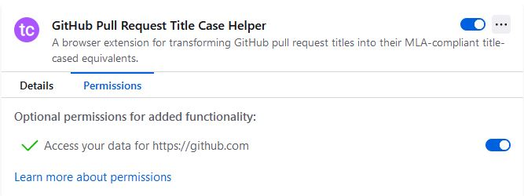

# Contributing to GitHub Pull Request Title Case Helper

1. [Development Workspace Setup](#development-workspace-setup)
2. [Commands](#commands)
   1. [TL;DR / Cheatsheet](#tldr--cheatsheet)
   2. [Firefox Testing Note](#firefox-testing-note)
   3. [All Commands](#all-commands)
3. [Deploying New Releases](#deploying-new-releases)

## Development Workspace Setup

To start development and testing, ensure you have Node.js 16.x or 18.x installed, then simply run
the following command.

```bash
npm install
```

Be aware that this project uses [husky](https://www.npmjs.com/package/husky/v/latest) and
[lint-staged](https://www.npmjs.com/package/lint-staged/v/latest) to ensure linting and formatting
are performed on all changed files prior to committing them. When you execute `npm install` without
any arguments, NPM will automatically run the `prepare` command defined in `package.json` to set up
the Husky git hook(s). If you install dependencies some other way, be sure to run

```bash
npm run prepare
```

before beginning development.

## Commands

### TL;DR / Cheatsheet

* Use `npm run chrome:dev` or `npm run firefox:dev` for hot-reloading browser-based development
* Use `npm run build` to create production-ready extension artifacts for both Chrome and Firefox in
  the `dist` folder
* Use `npm run test`/`npm run test:coverage` to run unit tests with/without coverage respectively

### Firefox Testing Note

If you are testing this extension in Firefox, note that there is an additional manual step required
to grant the extension access to `github.com`. For contextual information regarding this behavior,
see the discussions
[here](https://discourse.mozilla.org/t/extensions-using-content-scripts-without-any-user-action-wont-work-anymore-in-mv3/98728)
and
[here](https://discourse.mozilla.org/t/are-content-scripts-not-automatically-injected-anymore-with-manifest-v3/108146),
as well as the reply [here](https://discourse.mozilla.org/t/blog-post-manifest-v3-in-firefox-recap-next-steps/97372/7).

Here is what the permissions should look like:



### All Commands

```bash
npm run chrome:webext       # Deploys an already-built copy of the extension into a Chrome browser session
npm run chrome:live-reload  # Continuously builds the extension while watching for changes and deploys it into a Chrome browser session
npm run chrome:dev          # Builds the extension once, then continuously rebuilds the extension and deploys it into a Chrome browser session
npm run firefox:webext      # Deploys an already-built copy of the extension into a Firefox browser session
npm run firefox:live-reload # Continuously builds the extension while watching for changes and deploys it into a Firefox browser session
npm run firefox:dev         # Builds the extension once, then continuously rebuilds the extension and deploys it into a Firefox browser session
npm run clean               # Cleans the artifact output directory
npm run build               # Cleans the artifact output directory and builds all extension/extension artifacts for both Chrome and Firefox
npm run build:chrome        # Builds all Chrome extension artifacts
npm run build:firefox       # Builds all Firefox extension artifacts
npm run build:chrome:watch  # Builds all Chrome extension artifacts and watches for changes
npm run build:firefox:watch # Builds all Firefox extension artifacts and watches for changes
npm run test                # Runs all unit tests
npm run test:coverage       # Runs all unit tests with code coverage analysis
npm run lint-and-format     # Runs Stylelint and Prettier on the whole project
npm run prepare             # Performs finalizing installation steps for the project (e.g. husky install)
```

>Why is there a `:live-reload` *and* a `:dev` for the browser commands?

You may be wondering why both are defined when they seem to do the same thing. The nuance between
these two commands is that `:live-reload` will immediately try to serve whatever artifacts are
built - this is obviously problematic in situations where no former build has been performed (e.g.
immediately after a developer clones this repository). Therefore, we define `:dev` as a command
which performs the exact same operation, except it builds the necessary artifacts first. The end
result of this architecture is that we are *always* safe to run `:dev`, but we may or may not be
safe to run `:live-reload`.

## Deploying New Releases

>Note: every time you bump the `package.json` version, be sure to do another `npm install` to update
>this module's `package-lock.json` with the newest version of itself.

This project's static web artifacts get uploaded to the Chrome and Firefox extension marketplaces
via a manual process handled directly by [@cooperwalbrun](https://github.com/cooperwalbrun). The
upload will always coincide with a version increment and corresponding Git tag, so as a matter of
convention, you should always increment the `version` in [package.json](./package.json) if your
pull request contains the first change since the most recent release. Refer to the
[CHANGELOG.md](./CHANGELOG.md) to find out whether there have been any changes merged into the
`master` branch since the last versioned release.

When a new version is ready to be released, the [CHANGELOG.md](./CHANGELOG.md) will be updated with
the new version and the markdown badges in the [README.md](./README.md) will be updated. Typically,
this is done as part of the last pull request whose changes will be merged into `master`, but this
release preparation can also be done in its own dedicated pull request.
