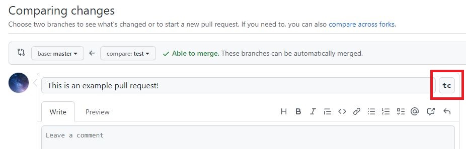
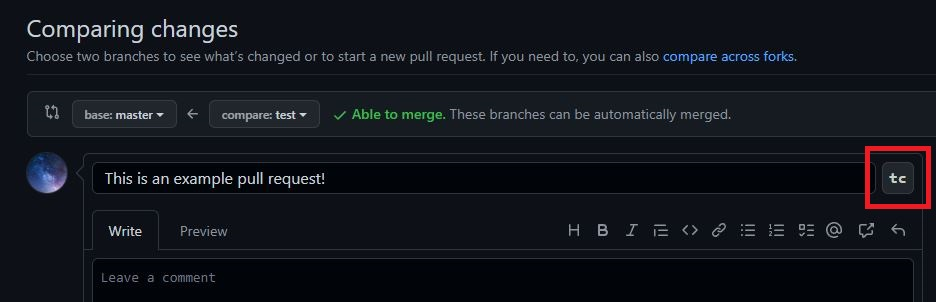
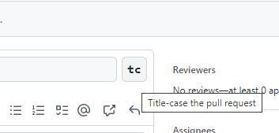
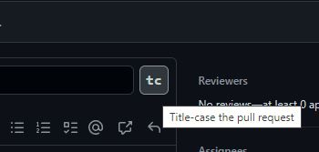

# GitHub Pull Request Title-Case Helper  

>Note: support for Firefox will come in a future release after Firefox finishes implementing support
>for extension Manifest v3. See
>[this blog post](https://blog.mozilla.org/addons/2022/06/08/manifest-v3-firefox-developer-preview-how-to-get-involved/)
>for more details.

1. [Overview](#overview)
2. [Project Notes](#project-notes)
   1. [Extension Icon](#extension-icon)
3. [Contributing](#contributing)

## Overview

`GitHub Pull Request Title-Case Helper` is a browser extension for transforming GitHub pull request titles into
their MLA-compliant title-cased equivalents. It aims to deliver this functionality across multiple
web browsers (currently, Chrome and Firefox).

The core mechanism introduced by this extension is a new `tc` button in the GitHub website's pull
request interface which, when clicked, will transform the pull request's title in-place. Below are
some examples.

Full view with pull request title textbox:

On mouse hover:

## Project Notes

Several of the things this repository does are influenced/informed by design decisions made in
[vitesse-webext](https://github.com/antfu/vitesse-webext) and
[vite-plugin-web-extension](https://github.com/aklinker1/vite-plugin-web-extension/tree/main). While
this project does not directly utilize either of these, they deserve recognition and support for
their valuable efforts!

### Extension Icon

The icon for this project was generated by running the
[Favicon Generator](https://favicon.io/favicon-generator), then copying and manipulating the output
files to create the variants with alternative dimensions.

The parameters used were:

* Text: `tc`
* Background: `Circle`
* Font Family: `Roboto`
* Font Variant: `Bold 700 Normal`
* Font Size: `90`
* Font Color: `#fff`
* Background Color: `#a5f`

## Contributing

See [CONTRIBUTING.md](CONTRIBUTING.md) for developer-oriented information.
